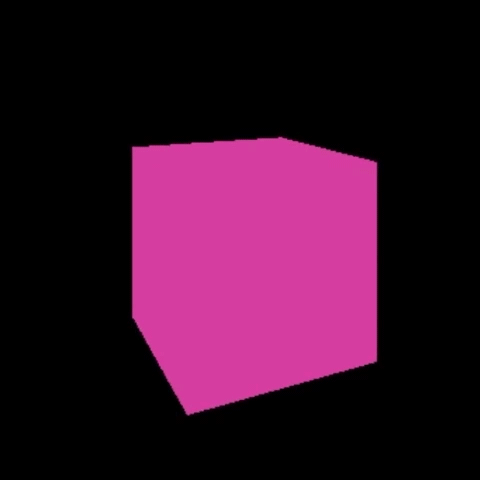
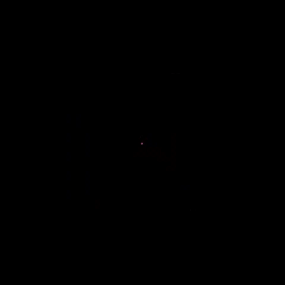

# ThreeJS Journey - Animations

Different animated versions of the scene from the [basic-scene](../basic-scene/) project.

## Description

A project consisting of different animations that utilizes [requestAnimationFrame](https://developer.mozilla.org/en-US/docs/Web/API/window/requestAnimationFrame) and the [GSAP](https://greensock.com/gsap/) library to animate the scene from the [basic-scene](../basic-scene/) project.

### Rotate

### Bounce

### Zoom

### Timeline

## Authors

Merry Rosalie [@MerryRosalie](https://github.com/MerryRosalie)
